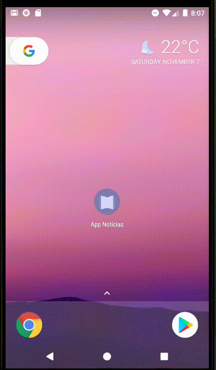
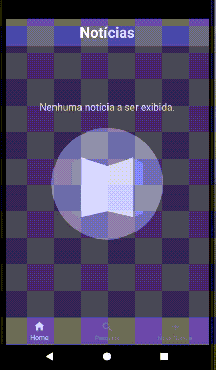
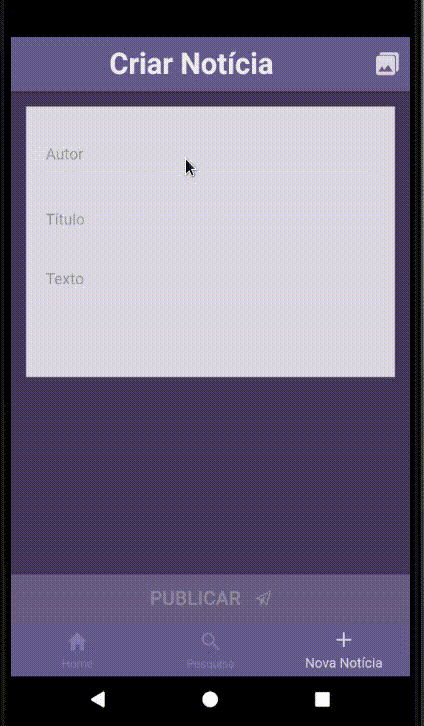
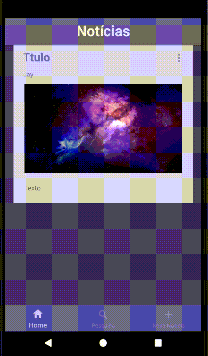
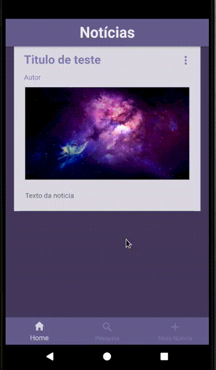

# App Notícias

App simples utilizando Ionic para visualização, cadastro e edição de notícias no banco local (sqlite).
Por conta dos pacotes e versões utilizadas, o projeto não roda como página web e apenas foi testado no Android.


## Sobre o projeto

### Tela de Listagem de Notícias (Home)

#### Funções:

* Acesso a uma lista com as Notícias salvas no banco local
* Acesso ao detalhamento de cada Notícia ao clicar sobre seu card
* Acesso às ações para cada Notícia (excluir, editar)


### Tela de Detalhamento da Notícia

#### Funções:

* Acesso aos dados da Notícia incluindo texto completo
* Acesso às ações da Notícia (excluir, editar)


### Tela de Pesquisa

#### Funções:

* Pesquisar notícia por Título, Autor ou Texto
* Acesso às ações da Notícia (excluir, editar)


### Tela de CRUD / Cadastro da notícia:

#### Funções:

* Cadastro
* Edição

##### Campos do cadastro:

* Título*
* Texto* (ilimitado)
* Autor* (chave estrangeira para a tabela Autor)
* Imagem
* Data de criação (auto-gerado)

**Obrigatório.*


## Demo













## Pacotes necessários

* [NodeJS](https://github.com/nodejs/node)
* [npm](https://github.com/npm/cli)
* [JDK 8](https://www.oracle.com/technetwork/java/javase/downloads/index.html)
* [Gradle](https://docs.gradle.org/current/userguide/installation.html)
* [ionic, cordova](https://ionicframework.com/docs/intro/installation/)

### Instalando as dependências no Arch Linux

#### Versões utilizadas:

- ionic@3.20.1 
- cordova@8.1.2
- node 8.10.0
- npm 5.6.0
- Java JDK8

Instalar o nodejs, npm, jdk8, gradle usando o gerenciador de pacotes (pacman): 
`pacman -S nodejs npm jdk8-openjdk gradle`

Então instalar o ionic e o cordova utilizando o npm:
`npm install -g ionic@3.20.1 cordova@8.1.2`
ou
`sudo npm install -g ionic@3.20.1 cordova@8.1.2`


#### Build 

###### Android 

1- Instalar dependências (`npm install`)
2- Caso ocorra um erro ao buildar por conta do node_modules/@types, remova este diretório (`rm -rf node_modules/@types`) antes de rodar o `ionic cordova`
3- Rodar (`ionic cordova run android`) ou apenas buildar (`ionic cordova prepare android`) com o ionic cordova

Para apenas buildar o pacote **Android**:
```
npm install
rm -rf node_modules/@types
ionic cordova prepare android
```

#### Run

###### Android

Para **rodar** o app no **Android**:
```
npm install
rm -rf node_modules/@types
ionic cordova run android
```

## Versões utilizadas para o build

Do output do comando `ionic info`:

```
    @ionic/cli-utils  : 1.19.3
    ionic (Ionic CLI) : 3.20.1

global packages:

    cordova (Cordova CLI) : 8.1.2 (cordova-lib@8.1.1) 

local packages:

    @ionic/app-scripts : 3.2.4
    Cordova Platforms  : android 7.1.4
    Ionic Framework    : ionic-angular 3.9.9

System:

    Android SDK Tools : 26.1.1
    Node              : v8.10.0
    npm               : 5.6.0 
    OS                : Linux X.X

```
